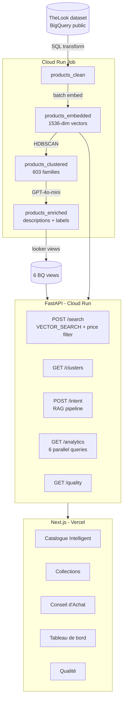
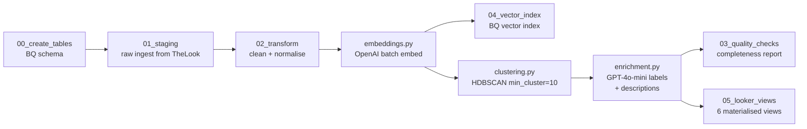
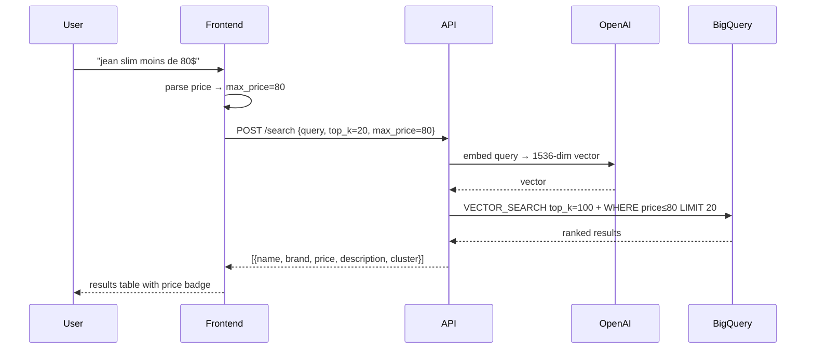
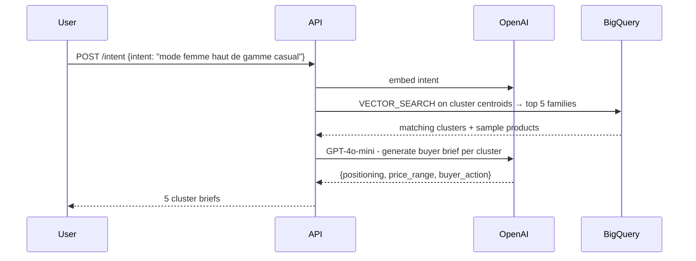

# Vitrine - Intelligent Product Catalogue

A full-stack data + GenAI platform that turns a raw 29k-product retail dataset into an intelligent catalogue: semantic search with price filtering, unsupervised clustering, AI-generated buyer briefs, and a live analytics dashboard.

**Live:** [vitrine-ten.vercel.app](https://vitrine-ten.vercel.app)

---

## The Problem

Traditional e-commerce search is keyword-based. A buyer who types *"slim jeans under $80"* expects price-aware results ranked by relevance, not a list of products that literally contain those words. Merchandising teams also lack automated tools to understand their assortment structure, price positioning, or category coverage.

Three concrete gaps:

1. **Discovery** - keyword search misses semantically close products ("slim fit denim" vs "slim jeans").
2. **Assortment intelligence** - no automated grouping of 29k products into coherent segments.
3. **Buyer briefing** - no tool to map a buyer profile to the right product families.

---

## The Solution

```
Raw catalogue  →  Embeddings  →  Clusters  →  Enrichment  →  API  →  UI
    (BQ)           (OpenAI)      (HDBSCAN)    (GPT-4o-mini)  (FastAPI) (Next.js)
```

| Feature | How it works |
|---|---|
| Semantic search | `text-embedding-3-small` vectors + BigQuery `VECTOR_SEARCH` (cosine), with SQL price filter |
| Product families | HDBSCAN over 1536-dim embeddings → 603 clusters, labelled by GPT-4o-mini |
| Buyer brief | RAG: embed intent → top-K clusters → GPT-4o-mini brief per family |
| Analytics dashboard | 6 parallel BigQuery views, Recharts, 10-min TTL cache |
| Data quality | Automated completeness report after each pipeline run |

---

## Architecture

### System overview



### Data pipeline



### Search request flow



### Buyer intent (RAG) flow



---

## Stack

| Layer | Technology |
|---|---|
| Data warehouse | BigQuery (Google Cloud) |
| Embeddings | OpenAI `text-embedding-3-small` |
| Clustering | HDBSCAN (`hdbscan` 0.8) |
| LLM | GPT-4o-mini |
| API | FastAPI + Pydantic, Cloud Run (min 1 instance) |
| Container registry | Artifact Registry |
| Frontend | Next.js 15, Tailwind v4, Recharts |
| Hosting | Vercel |
| CI/CD | GitHub Actions + Workload Identity Federation |
| Secrets | Google Secret Manager |

---

## Repository structure

```
vitrine/
├── pipeline/          # Batch data pipeline (Cloud Run Job)
│   ├── main.py        # Orchestrator
│   ├── embeddings.py  # OpenAI batch embedding
│   ├── clustering.py  # HDBSCAN + cluster labelling
│   └── enrichment.py  # GPT-4o-mini descriptions
├── api/               # FastAPI service (Cloud Run)
│   ├── routers/       # One file per endpoint
│   └── services/      # Business logic + BQ queries
├── frontend/          # Next.js app (Vercel)
│   └── src/app/       # One folder per page
├── sql/               # BigQuery DDL and transforms
├── docker/            # Dockerfiles for pipeline and API
├── infra/             # Setup scripts (GCP, IAM, BQ tables)
└── .github/workflows/ # CI/CD - build, push, deploy
```

Full file-level documentation in [`docs/`](docs/).
