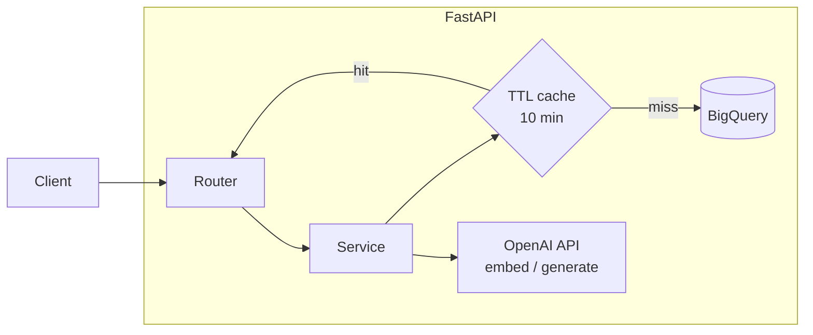
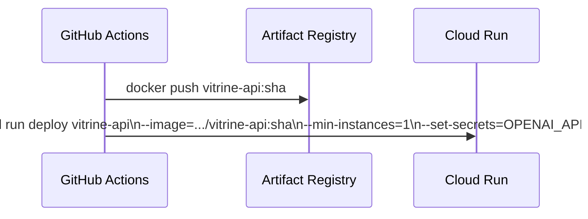

# API

FastAPI service deployed on Cloud Run (`min-instances=1` to eliminate cold starts). All routes are stateless; expensive BigQuery results are cached in-process with a 10-minute TTL.

## Endpoints

| Method | Path | Description |
|---|---|---|
| `POST` | `/search` | Semantic search with optional price filter |
| `GET` | `/clusters` | All product families |
| `GET` | `/clusters/{id}/products` | Products in a given family |
| `POST` | `/intent` | Buyer intent → RAG briefs |
| `GET` | `/analytics` | 6 aggregated views in parallel |
| `GET` | `/quality` | Latest data quality report |

---

## Architecture



---

## Files

### `main.py`

App entrypoint. Registers all routers and creates a shared BigQuery client on startup via `lifespan`.

### `config.py`

Reads GCP project, dataset, table names, and API keys from environment. Table name helpers:

```python
TABLE_CLEAN     = f"{PROJECT}.{DATASET}.products_clean"
TABLE_EMBEDDED  = f"{PROJECT}.{DATASET}.products_embedded"
TABLE_CLUSTERED = f"{PROJECT}.{DATASET}.products_clustered"
TABLE_ENRICHED  = f"{PROJECT}.{DATASET}.products_enriched"
TABLE_QUALITY   = f"{PROJECT}.{DATASET}.data_quality"
```

### `models/schemas.py`

All Pydantic request/response models. Single source of truth for the API contract.

Key models:

| Model | Fields |
|---|---|
| `SearchRequest` | `query`, `top_k`, `max_price?`, `min_price?` |
| `SearchResponse` | `query`, `results: [ProductResult]` |
| `IntentRequest` | `intent`, `top_k_clusters` |
| `IntentResponse` | `intent`, `clusters: [ClusterBrief]` |
| `ClusterBrief` | `cluster_id/label`, `positioning`, `price_range`, `buyer_action`, `sample_products` |

### `services/cache.py`

Simple in-process TTL cache. Key = `qualname + args[1:]` (skips the BigQuery client argument).

```python
@ttl_cache(seconds=600)
def get_clusters(bq): ...
```

Not shared across Cloud Run instances; acceptable because data only changes after a pipeline run.

### `services/search_service.py`

1. Embeds the query via OpenAI.
2. When a price filter is present, oversamples (`top_k × 5` candidates) to ensure enough results survive the `WHERE` clause.
3. Runs `VECTOR_SEARCH` in BigQuery with a `JOIN` to `products_clean`, `products_clustered`, and `products_enriched`.

```sql
VECTOR_SEARCH(TABLE products_embedded, 'embedding',
  (SELECT [...] AS embedding), top_k => 100, distance_type => 'COSINE')
...
WHERE retail_price <= 80
ORDER BY distance ASC
LIMIT 20
```

### `services/cluster_service.py`

- `get_clusters` - aggregates cluster size and average price, excludes noise (`cluster_id != -1`).
- `get_cluster_products` - returns up to 200 products for a given cluster with enriched descriptions.

Both decorated with `@ttl_cache(seconds=600)`.

### `services/intent_service.py`

RAG pipeline:

1. Embed the intent string.
2. `VECTOR_SEARCH` on cluster embeddings (centroid per cluster computed on the fly) → top-K clusters.
3. For each cluster, fetch sample products and call GPT-4o-mini to generate `positioning`, `price_range`, and `buyer_action`.
4. Return structured `ClusterBrief` objects.

### `services/analytics_service.py`

Fires 6 BigQuery view queries in parallel via `ThreadPoolExecutor(max_workers=6)`. Results cached for 10 minutes.

```python
views = [
    "looker_cluster_distribution",
    "looker_pricing_per_cluster",
    "looker_heatmap_cat_dept",
    "looker_data_quality",
    "looker_sales_timeline",
    "looker_brands_per_cluster",
]
```

### `services/quality_service.py`

Queries `data_quality` for the most recent report row ordered by `report_timestamp DESC`.

---

## Deployment



Service account used at runtime: `vitrine-cloud-run@...` with roles `BigQuery Data Viewer`, `BigQuery Job User`, `Secret Manager Secret Accessor`.
