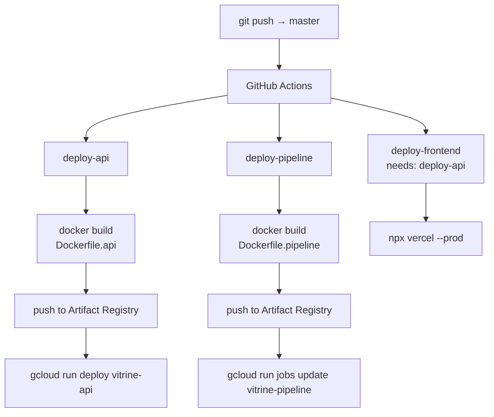

# Infrastructure & Deployment

## GCP resources

| Resource | Name | Purpose |
|---|---|---|
| Project | `vitrine-wamba-2026` | All GCP resources |
| Region | `europe-west1` | Cloud Run + Artifact Registry |
| BigQuery dataset | `vitrine` | All tables and views |
| Artifact Registry | `vitrine-docker` | Docker images |
| Cloud Run service | `vitrine-api` | API (always-on, min 1 instance) |
| Cloud Run job | `vitrine-pipeline` | Batch pipeline (on-demand) |
| Secret | `openai-api-key` | Injected at runtime |

## Service accounts

| Account | Roles | Used by |
|---|---|---|
| `github-actions-deployer@...` | `run.admin`, `artifactregistry.writer`, `iam.serviceAccountUser` | GitHub Actions (deploy only) |
| `vitrine-cloud-run@...` | `bigquery.dataViewer`, `bigquery.jobUser`, `secretmanager.secretAccessor` | API + pipeline at runtime |

## CI/CD



Authentication from GitHub Actions to GCP uses **Workload Identity Federation** (no long-lived service account keys stored in GitHub Secrets).

## Cloud Run - API

```
--min-instances=1       # eliminates cold start
--max-instances=3
--memory=512Mi
--cpu=1
--set-secrets=OPENAI_API_KEY=openai-api-key:latest
--service-account=vitrine-cloud-run@...
```

## Cloud Run - Pipeline Job

```
--memory=4Gi            # HDBSCAN needs memory for 29k × 1536 matrix
--cpu=2
--set-secrets=OPENAI_API_KEY=openai-api-key:latest
```

## Setup scripts

| File | Purpose |
|---|---|
| `infra/setup.sh` | Enable GCP APIs, create Artifact Registry repo, Cloud Run service/job |
| `infra/iam.sh` | Create service accounts, bind roles, configure WIF pool and provider |
| `infra/create_bq_tables.py` | Run all SQL scripts in `sql/` to create tables and views |
| `infra/run_sql.py` | Run a single SQL file against BigQuery |

## Secrets

Only one secret in Secret Manager: `openai-api-key`. The OpenAI key is never stored in source code, `.env` files, or GitHub Secrets - it is fetched at container startup via the `--set-secrets` Cloud Run flag.

The `api/.env` file (local dev only) is gitignored.
