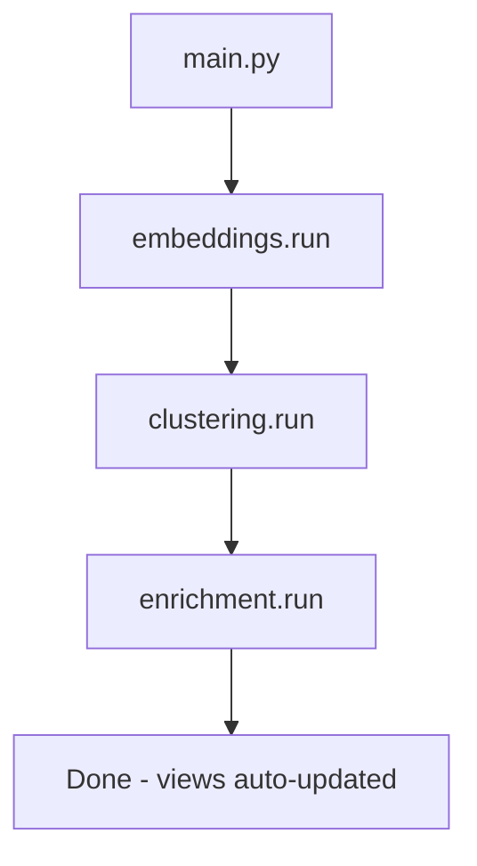

# Pipeline

The pipeline is a Cloud Run Job that runs on demand. It processes the raw TheLook dataset from BigQuery into enriched, embedded, and clustered product records.

## Execution order



Each step is incremental: it skips products already processed, so re-runs are cheap.

---

## Files

### `main.py`

Orchestrator. Calls each step in sequence and logs a summary dict per step.

```python
steps = [embeddings.run, clustering.run, enrichment.run]
```

Exits with a non-zero code on failure so Cloud Run marks the job as failed.

### `config.py`

Centralises every constant: GCP project, dataset, table names, model names, batch sizes. All values read from environment variables (injected by Cloud Run from Secret Manager).

Key values:

| Variable | Default | Purpose |
|---|---|---|
| `EMBEDDING_MODEL` | `text-embedding-3-small` | OpenAI embedding model |
| `EMBEDDING_BATCH_SIZE` | 100 | Products per API call |
| `HDBSCAN_MIN_CLUSTER` | 10 | Minimum cluster size |
| `LLM_MODEL` | `gpt-4o-mini` | Used for labelling and descriptions |

### `bq_client.py`

Returns a singleton `google.cloud.bigquery.Client` authenticated via the Cloud Run service account (Workload Identity, no key file needed).

### `embeddings.py`

Fetches products not yet in `products_embedded`, builds an embedding string per product (`name | brand | category | department`), calls the OpenAI API in batches of 100 with exponential backoff, and streams results to BigQuery.

Cost tracking: tokens and estimated USD cost logged per batch.

```
embedding_text = "Levi's 501 Original | Levi's | Jeans | Men"
→ 1536-dim float vector
```

### `clustering.py`

Loads all embedding vectors from `products_embedded`, runs HDBSCAN (`min_cluster_size=10`, cosine metric), and writes `(product_id, cluster_id)` to `products_clustered`.

Then calls GPT-4o-mini with a sample of 20 product names per cluster to generate a short human-readable label (e.g. "Premium Men's Denim").

Noise points (cluster_id = -1) are kept in the table but excluded from all aggregations.

### `enrichment.py`

For each product not yet in `products_enriched`, calls GPT-4o-mini to generate a 2-3 sentence product description. Processes in batches of 20 with a polite delay to avoid rate limits.

Output stored in `products_enriched.description_enriched`.

---

## BigQuery tables written

| Table | Written by | Content |
|---|---|---|
| `products_embedded` | `embeddings.py` | 1536-dim vectors |
| `products_clustered` | `clustering.py` | cluster_id, cluster_label |
| `products_enriched` | `enrichment.py` | AI-generated descriptions |

## SQL scripts (run once at setup)

| File | Purpose |
|---|---|
| `sql/00_create_tables.sql` | DDL for all tables |
| `sql/01_staging.sql` | Ingest from TheLook public dataset |
| `sql/02_transform.sql` | Clean and normalise into `products_clean` |
| `sql/03_quality_checks.sql` | Completeness report → `data_quality` |
| `sql/04_vector_index.sql` | Build IVF vector index on `products_embedded` |
| `sql/05_looker_views.sql` | 6 materialised views for analytics |
